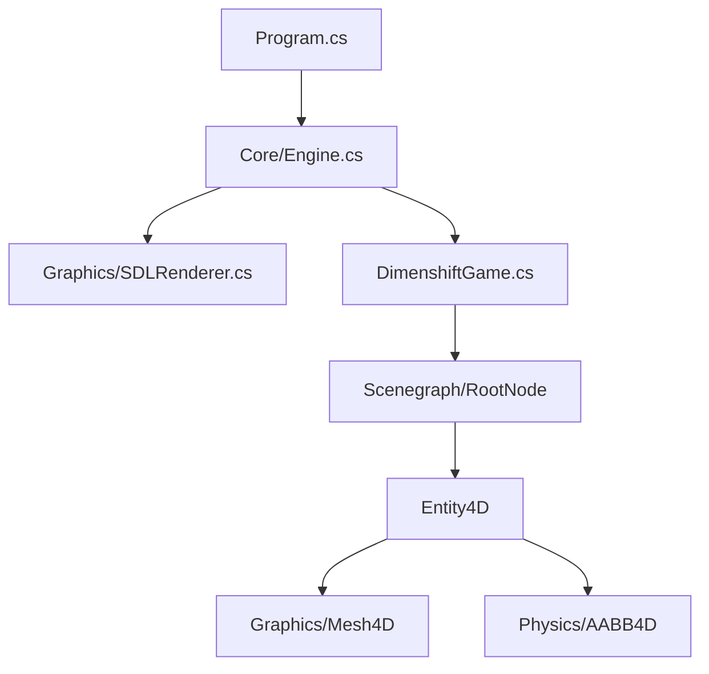

# Dimenshift – 4D Voxel Sandbox Engine


**Dimenshift** is a cutting-edge experimental voxel game engine designed to explore interaction and movement within **four-dimensional Euclidean space**. By extending traditional voxel mechanics into a fourth spatial dimension ($x, y, z, w$), Dimenshift offers a unique sandbox experience where players can navigate and manipulate hyperspace structures.

This project is a high-performance **C#** portfolio demonstrating **Enterprise Architecture**, **Advanced Math**, and **Physics Programming**.

---

## 🚀 Key Features

| Feature | Description |
|:---|:---|
| **🌀 4D Locomotion** | True 4-axis freedom of movement. Strafe through walls by sidestepping in $w$. |
| **✨ Tesseract Rendering** | Real-time **4D -> 3D -> 2D** double-projection pipeline to visualize hypercubes. |
| **💥 Hyper-Physics** | **AABB4D** Collision Detection and **Ray4D** Raycasting for selecting hyperspace objects. |
| **� Scenegraph** | Entity-Component style hierarchy using `Node4D` and `Transform4D`. |
| **�🎮 SDL2 Powered** | Built on top of `SDL2-CS` for lightweight, hardware-accelerated input and windowing. |
| **🧮 Custom Math Lib** | Implementation of `Vector4`, `Matrix5`, and 4D Rotor logic from scratch. |

---

## 🛠️ Technical Stack

- **Language**: C# 8.0 / .NET Core 3.1+
- **Graphics & Input**: SDL2 (via SDL2-CS bindings)
- **Architecture**: Decoupled Game Loop (`Engine.cs`, `IGame`, `IRenderer`).
- **Math**: Custom `Hyxel.Math` library with `[AggressiveInlining]` and `ref` optimizations.

---

## 📦 Installation & Build

### Prerequisites
- **.NET SDK** (3.1 or later)
- **SDL2 Runtime Binaries** (dll/dylib/so) placed in the output folder.

### Run the Demo

1. **Clone the Repository**
   ```bash
   git clone https://github.com/sidthebuilder/Dimenshift.git
   cd Dimenshift
   ```

2. **Run the Engine**
   ```bash
   dotnet run --project Hyxel/Hyxel.csproj
   ```
   *You will see a rotating Tesseract wireframe. Hover over it to see 4D Collision Detection in action!*

---

## 🧠 Architecture Overview



---

## 🤝 Contributing

We welcome contributions from 4D math enthusiasts and engine developers! 

1. Fork the Project
2. Create your Feature Branch (`git checkout -b feature/HyperProjection`)
3. Commit your Changes (`git commit -m 'Add 5th dimension support'`)
4. Push to the Branch (`git push origin feature/HyperProjection`)
5. Open a Pull Request

---

## 📜 License

This project is open-source software licensed under the **Unlicense** (Public Domain).

---

*Maintained by the Dimenshift Open Source Community.*
